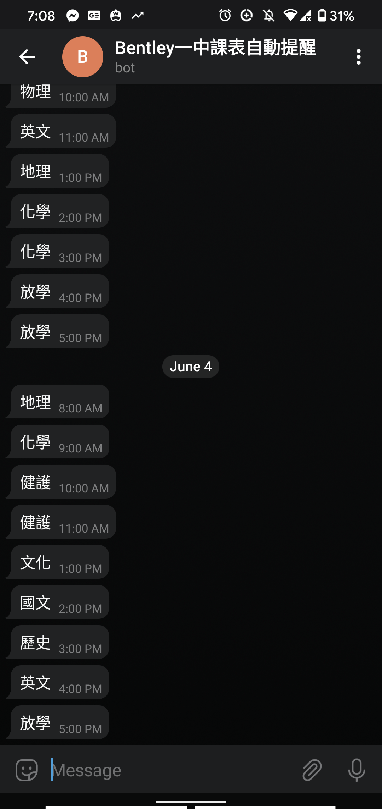

# nextclass-telegram

1.去跟Telegram的botfather申請token，然後把那個bot加到你要放的群組裡，並取的那個群組的chatid. 
<a href="https://stackoverflow.com/questions/32423837/telegram-bot-how-to-get-a-group-chat-id" target="_blank" title="">不知道如何取得機器人token與chatid請參考這篇</a> 

2.輸入bot_token和chat_id.

3.設定crontab.
0 7 * * * python3 /path/to/your/ex.py
